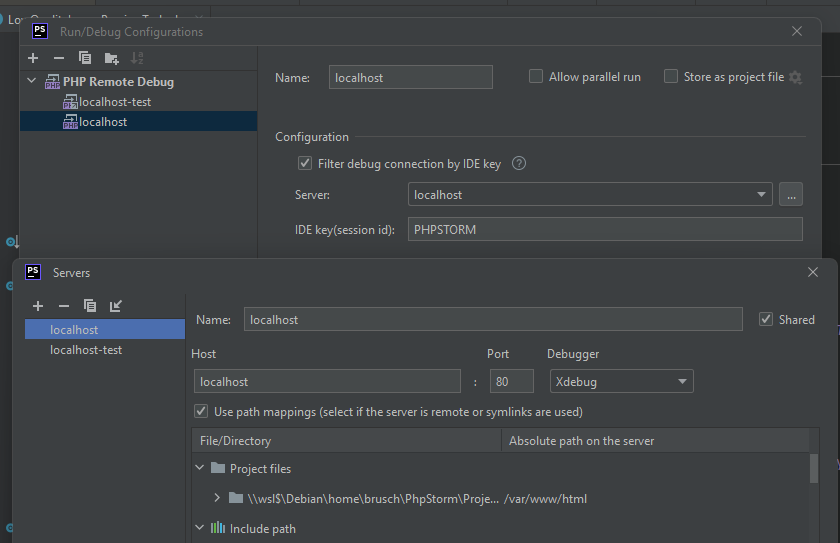

# Pimcore PHP Docker Image

This is are customized PHP Docker images specifically optimized for running [Pimcore](https://github.com/pimcore/pimcore).
It doesn't include the Pimcore software itself, it just provides an environment that fulfills all system requirements
of Pimcore, so that you can leverage the full functionality.

You can either use this image directly by mounting Pimcore into the container, or as a template for your customized 
ready-to-deploy images.   

## Usage  
As a starting point please see [example docker-compose configuration](https://github.com/pimcore/skeleton/blob/HEAD/docker-compose.yaml).

## Image flavors
We're providing different image flavors: 
- [`min`] PHP image for FPM and CLI with minimum requirements (e.g. `php8.2-min-latest`)
- [`default`] PHP image for FPM and CLI incl. all optional dependencies (e.g. `php8.2-latest` or `php8.2-default-latest`)
- [`max`] PHP image for FPM and CLI incl. all optional dependencies and additional extensions and software (e.g. `php8.2-max-latest`)
- [`debug`] PHP debug image based on the `default` flavor, including preconfigured Xdebug for FPM and CLI (e.g.  `php8.2-debug-latest`)
- [`supervisord`] Supervisord image based on PHP image above, for cron & queue processing  (e.g. `php8.2-supervisord-latest`)

## Versioning
Our images are versioned using a version-suffix staring with `-v` following SemVer (e.g. `-v2.0`).   
With that we're able to allow smooth upgrades, breaking changes are only delivered with major versions.  
Additionally we're offering 2 special tag suffixes: 
- `-latest` always points to the latest available tag (recommended for local development)
- `-dev` always points to the work in progress

We're also offering special tags for specific PHP versions, e.g. `php8.2.5-v2.0`. 

## Hardened images
For our stable release tags we publish each image in two flavors so you can choose your trade-off:

- **plain** (default, unsuffixed) – the image exactly as built from the Dockerfile, e.g. `php8.5-debug-v5`. Published as-is; it may carry known OS-level CVEs.
- **hardened** (`-hardened` suffix) – the same image with OS-level CVEs patched in via [Copacetic (Copa)](https://github.com/project-copacetic/copacetic), e.g. `php8.5-debug-v5-hardened`.

**What hardening does:** after the plain image is built it is scanned with [Trivy](https://github.com/aquasecurity/trivy) and Copa applies the Debian security updates that are *available* for the affected OS packages, as an extra image layer. PHP, its extensions, and all application-level content are identical to the plain image — only OS package versions differ.

**What the gate does (and does not) guarantee:** the `-hardened` tag is published only when, after patching, no **fixable** CVE at or above the `fail_on_severity` threshold remains — i.e. Copa applied every fix that was available. `fail_on_severity` is a **threshold** (default `CRITICAL,HIGH`): naming a severity also gates everything above it (e.g. `HIGH` gates HIGH and CRITICAL), and `NONE` disables the gate. The gate does **not** shield against CVEs that have **no upstream fix yet** — those are excluded from the scan and remain in *both* the plain and hardened images until Debian ships a fix. So `-hardened` means "all currently-fixable OS CVEs at the threshold are patched", not "zero known CVEs".

**Scope:** `-hardened` exists for **stable release tags only**; development tags (`-dev`) are plain-only. The plain tag **always publishes**, even when CVEs remain.

**Choosing a flavor:** prefer **hardened** for production or vulnerability-scanned environments where you want the latest available OS fixes baked in; use **plain** when you need the image exactly as built (reproducibility, or you run your own patching/scanning pipeline).

```text
php8.5-debug-v5          # plain image, as built (may contain CVEs)
php8.5-debug-v5-hardened # same image, all available OS CVE fixes applied
```

**SBOMs:** every published image (plain and hardened, per architecture) ships an SPDX SBOM. It is always uploaded as a build artifact, and — where the target registry supports OCI referrers — also attached to the published image (discoverable with `oras discover`).

## Container registries
Our images are available on both Docker Hub and the GitHub Container Registry, so you can choose the one that best fits your workflow.
Use either of the following commands:
`docker pull ghcr.io/pimcore/pimcore:php8.3-debug-v3-dev` or 
`docker pull pimcore/pimcore:php8.3-debug-v3-dev`


### Pimcore version compatibility & recommendations
| Image / Pimcore | v10 | v11 | v2023.3 | v2024.4 | v2025.x | v2026.x |
|-----------------|-----|-----|---------|---------|------|-------|
| v1              | ✅  | ✅  | ✅      | ✅      | ❌   | ❌    |
| v2              | ❌  | ✅  | ✅      | ✅      | ❌   | ❌    | 
| v3              | ❌  | ✅* | ✅*     | ✅*     | ✅   | ❌    |
| v4              | ❌  | ❌  | ❌      | ❌      | ✅*  | ❌    |
| v5              | ❌  | ❌  | ❌      | ❌      | ❌   | ✅*   |


> *) recommended version

## Examples 

### PHP images
```text
php8.2-latest # always use the latest PHP 8.2 image
php8.2-v1 # always point to the latest minor version of v1
php8.2-v1.0 # pin to specific image version, always using the latest bugfixes from PHP 8.2
php8.2.5-v1.0 # pin to a specific PHP version & image version 
php8.2-dev # development image (build from the default branch) 
```

### PHP Debug images
Same as PHP images, but using `-debug` after the PHP version:
```text
php8.2-debug-latest
php8.2-debug-v3
...
```

#### Configure Xdebug in your IDE

The following configuration depends on the default [`docker-compose.yaml`](https://github.com/pimcore/skeleton/blob/11.x/docker-compose.yaml). 



#### Use step-debugging

- **Browser**: Install "Xdebug helper" browser extension for [Chrome](https://chrome.google.com/webstore/detail/xdebug-helper/eadndfjplgieldjbigjakmdgkmoaaaoc) or [Firefox](https://addons.mozilla.org/en-GB/firefox/addon/xdebug-helper-for-firefox/) and start debugging session in your tab. 
- **CLI**: Run your command like this: `docker compose exec -e XDEBUG_TRIGGER=PHPSTORM php bin/console`

### Supervisord
Same as PHP images, but using `-supervisor` after the PHP version:
```text
php8.2-supervisor-latest
php8.2-supervisor-v3
...
```
