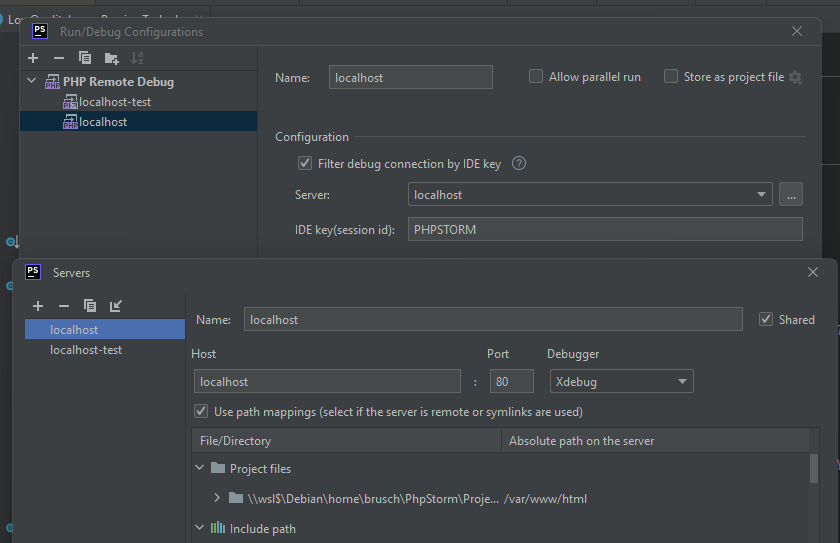

# Pimcore PHP Docker Image

This is are customized PHP Docker images specifically optimized for running [Pimcore](https://github.com/pimcore/pimcore).
It doesn't include the Pimcore software itself, it just provides an environment that fulfills all system requirements
of Pimcore, so that you can leverage the full functionality.

You can either use this image directly by mounting Pimcore into the container, or as a template for your customized 
ready-to-deploy images.   

## Usage  
As a starting point please see [example docker-compose configuration](https://github.com/pimcore/skeleton/blob/HEAD/docker-compose.yaml).

## Image flavors
We're providing 3 different image flavors: 
- PHP image for FPM and CLI with minimum requirements (e.g. `php8.1-min-latest` or `php8.2-min-latest`)
- PHP image for FPM and CLI incl. all optional dependencies (e.g. `php8.1-latest` or `php8.2-latest`)
- PHP debug image based on PHP image above, including preconfigured Xdebug for FPM and CLI (e.g. `php8.1-debug-latest` or `php8.2-debug-latest`)
- Supervisord image based on PHP image above, for cron & queue processing  (e.g. `php8.1-supervisord-latest` or `php8.2-supervisord-latest`)

## Versioning
Our images are versioned using a version-suffix staring with `-v` following SemVer.   
With that we're able to allow smooth upgrades, breaking changes are only delivered with major versions.  
Additionally we're offering 2 special tag suffixes: 
- `-latest` always points to the latest available tag (recommended for local development)
- `-dev` always points to the work in progress

We're also offering special tags for specific PHP versions, e.g. `php8.1.11-v1.0`. 

### Pimcore version compatibility & recommendations
| Image / Pimcore | v10 | v11 | v2023.0 |
|-----------------|-----|-----|---------|
| v1              | ✅   | ✅   | ✅       |
| v2              | ❌   | ✅*  | ✅*      |

> *) recommended version

## Examples 

### PHP images
```text
php8.1-latest # always use the latest PHP 8.1 image
php8.1-v1 # always point to the latest minor version of v1
php8.1-v1.0 # pin to specific image version, always using the latest bugfixes from PHP 8.1
php8.1.11-v1.0 # pin to a specific PHP version & image version 
php8.1-dev # development image (build from the default branch) 
```

### PHP Debug images
Same as PHP images, but using `-debug` after the PHP version:
```text
php8.1-debug-latest
php8.1-debug-v1
...
```

#### Configure Xdebug in your IDE

The following configuration depends on the default [`docker-compose.yaml`](https://github.com/pimcore/skeleton/blob/11.x/docker-compose.yaml). 



#### Use step-debugging

- **Browser**: Install "Xdebug helper" browser extension for [Chrome](https://chrome.google.com/webstore/detail/xdebug-helper/eadndfjplgieldjbigjakmdgkmoaaaoc) or [Firefox](https://addons.mozilla.org/en-GB/firefox/addon/xdebug-helper-for-firefox/) and start debugging session in your tab. 
- **CLI**: Run your command like this: `docker compose exec -e XDEBUG_TRIGGER=PHPSTORM php bin/console`

### Supervisord
Same as PHP images, but using `-supervisor` after the PHP version:
```text
php8.1-supervisor-latest
php8.1-supervisor-v1
...
```